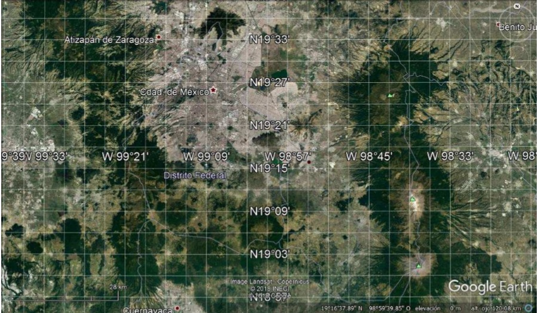
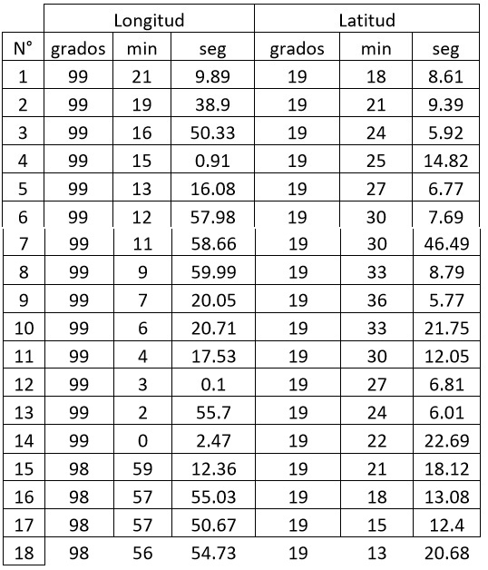
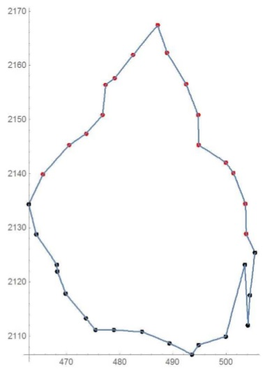
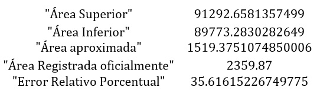

<iframe width="100%"  height="500" src="./globeCities.html"></iframe>
# Visualizacion: Raúl Martínez
## Descripción del proyecto:
**Área de la CDMX**

##  Objetivos:
1. Crear una manera de hallar el área de CDMX usando Métodos Numéricos

## Desarrollo

## Análisis del Índice de las Ciudades Prósperas (CPI) en México

ONU-Habitat está llevando a cabo el cálculo del CPI en el marco del proyecto El Infonavit liderando el cumplimiento de la Agenda 2030: la vivienda en el centro del cumplimiento de los Objetivos de Desarrollo Sostenible, que se desarrolla en colaboración con el Instituto del Fondo Nacional de la Vivienda para los Trabajadores (INFONAVIT) dentro de las actividades de la Secretaría de Desarrollo Agrario, Territorial y Urbano (SEDATU).

Así, entre las seis dimensiones que mide el CPI las que presentan un resultado preliminar más débil son Gobernanza y Legislación Urbana y Sostenibilidad Ambiental. Por el contrario, las dimensiones con resultados más sólidos son Infraestructura de Desarrollo y Calidad.

Es de interés para tu futuro desarrollo realizar una metodología que permita fortalecer la parte de la Legislación Urbana.

 

Con el contorno de la CDMX podemos tomar los valores de la Longitud y de la Latitud, por ejemplo, a continuación, se dan 18 puntos tomados de Google Earth, del contorno superior de la entidad

 

 Luego con ayuda de la **“Calculadora geodésica de coordenadas”**[link](http://franzpc.com/apps/conversor-coordenadas-geograficas-utm.html), podemos pasar los puntos a metros ó kilómetros

 

 Ilustramos una idea de los puntos tomados, tanto del contorno superior como inferior de la **CDMX**

   

   Con esta lista de datos, lo podemos poner en un Software, digamos **Wolfram Mathematica**, y lo podemos pelotear, como se ilustra.

 

 Una vez que tenemos la función f que modela el contorno superior y una función g que modela el contorno inferior, podemos hacer los cálculos del área superior y del área inferior y hallar al área comprendida entre los dos contornos y calcular el error relativo porcentual que se comete con el registro oficial del área de dicha entidad, es decir

  

 Y de esta manera, con mayores puntos que se usen el error que se comete es menor y podemos tener una idea más real del área que estamos tratando de hallar.
 
